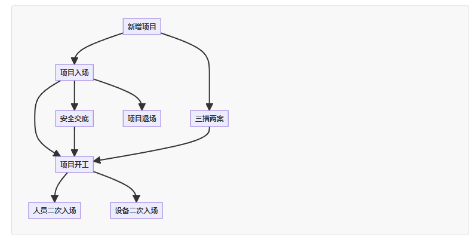

```
现在我有一个流程，分别是，新增项目，项目入场，三措两案，安全交底，项目开工，人员二次入场，设备二次入场，项目退场。
其中，新增项目是必须要做的，项目入场和三措两案为平级关系，而安全交底必须在项目入场后做，但是可以不做三措两案就做安全交底，项目开工必须项目入场，三措两案，安全交底后进行，人员二次入场和设备二次入场必须是开工后进行，项目退场必须是项目入场之后才能做，给出流程图
```
如图：



给出做法：

```java
import java.util.ArrayList;
import java.util.List;

abstract class ProjectStage {
    String name;
    boolean completed;

    ProjectStage(String name) {
        this.name = name;
        this.completed = false;
    }

    void complete() {
        this.completed = true;
        System.out.println(name + " 已完成.");
    }

    boolean isCompleted() {
        return completed;
    }
}

class AddProject extends ProjectStage {
    AddProject() {
        super("新增项目");
    }
}

class ProjectCommencement extends ProjectStage {
    ProjectCommencement() {
        super("项目入场");
    }
}

class ThreeMeasuresTwoPlans extends ProjectStage {
    ThreeMeasuresTwoPlans() {
        super("三措两案");
    }
}

class SafetyDisclosure extends ProjectStage {
    SafetyDisclosure() {
        super("安全交底");
    }
}

class StartProject extends ProjectStage {
    StartProject() {
        super("项目开工");
    }
}

class PersonnelEntry extends ProjectStage {
    PersonnelEntry() {
        super("人员二次入场");
    }
}

class EquipmentEntry extends ProjectStage {
    EquipmentEntry() {
        super("设备二次入场");
    }
}

class ProjectExit extends ProjectStage {
    ProjectExit() {
        super("项目退场");
    }
}

public class ProjectFlow {
    private List<ProjectStage> stages = new ArrayList<>();

    public ProjectFlow() {
        stages.add(new AddProject());
        stages.add(new ProjectCommencement());
        stages.add(new ThreeMeasuresTwoPlans());
        stages.add(new SafetyDisclosure());
        stages.add(new StartProject());
        stages.add(new PersonnelEntry());
        stages.add(new EquipmentEntry());
        stages.add(new ProjectExit());
    }

    public void runFlow() {
        // 新增项目
        stages.get(0).complete();

        // 项目入场和三措两案
        ProjectCommencement projectCommencement = (ProjectCommencement) stages.get(1);
        ThreeMeasuresTwoPlans threeMeasuresTwoPlans = (ThreeMeasuresTwoPlans) stages.get(2);

        projectCommencement.complete();
        threeMeasuresTwoPlans.complete(); // 可根据实际需要选择性完成

        // 安全交底
        SafetyDisclosure safetyDisclosure = (SafetyDisclosure) stages.get(3);
        safetyDisclosure.complete();

        // 项目开工
        StartProject startProject = (StartProject) stages.get(4);
        startProject.complete();

        // 人员和设备二次入场
        PersonnelEntry personnelEntry = (PersonnelEntry) stages.get(5);
        EquipmentEntry equipmentEntry = (EquipmentEntry) stages.get(6);
        personnelEntry.complete();
        equipmentEntry.complete();

        // 项目退场
        ProjectExit projectExit = (ProjectExit) stages.get(7);
        projectExit.complete();
    }

    public static void main(String[] args) {
        ProjectFlow projectFlow = new ProjectFlow();
        projectFlow.runFlow();
    }
}
```

# 说明：
#### 1.项目阶段类: 创建一个 ProjectStage 抽象类，定义项目阶段，包含名称和完成状态。
#### 2. 具体阶段类: 每个具体的项目阶段（如新增项目、项目入场等）都继承自 ProjectStage。
#### 3.流程管理: 在 ProjectFlow 类中，维护一个多个阶段的列表，按照业务逻辑控制各个阶段的完成。
#### 4.执行流程: 在 runFlow 方法中，按顺序执行项目阶段，逻辑符合您所描述的流程。


